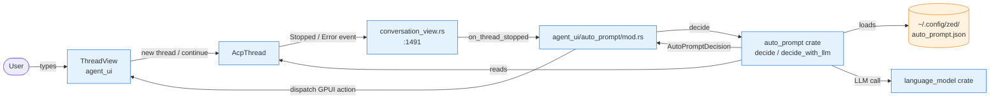
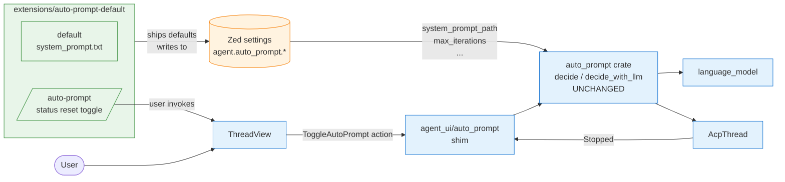
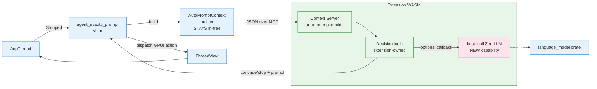
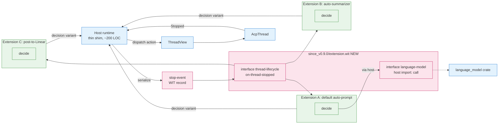
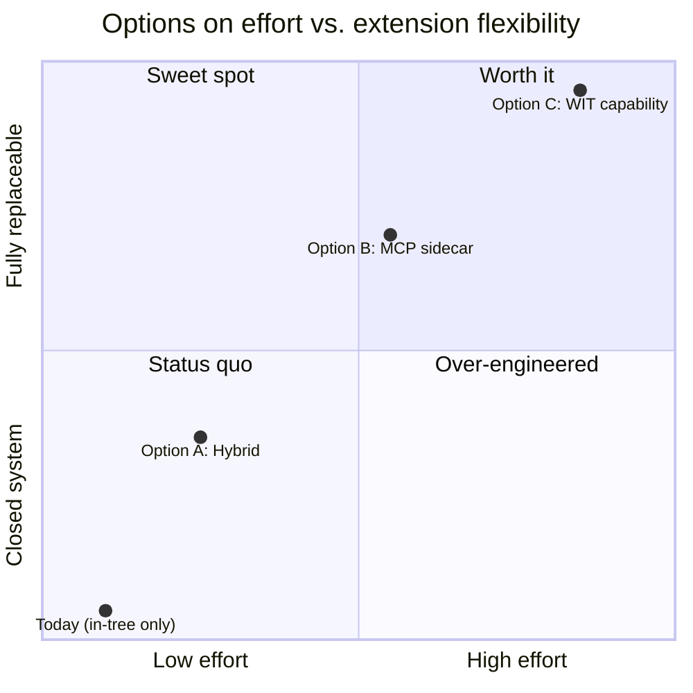

# auto_prompt → extension: feasibility & plan

Status: planning only, not implemented.
Last updated: 2026-05-09.

## TL;DR

`auto_prompt` cannot be ported to a pure Zed extension as it stands today. The
extension API (`crates/extension_api/wit/since_v0.8.0/`) exposes language
servers, slash commands, context servers (MCP), DAP, HTTP, process, and
settings — and nothing else. `auto_prompt` needs three host capabilities that
the WIT does not provide: thread-lifecycle subscription, live `AcpThread`
state access, and the ability to dispatch GPUI actions / call Zed's
`language_model` crate.

There are three realistic paths forward, listed below from least to most
invasive. Recommendation: **Option A (Hybrid)** as a first step; revisit
Option C only if a second use case for thread-lifecycle hooks shows up.

---

## What the crate actually does today

Code map (verified by reading the files in this session):

- `crates/auto_prompt/src/auto_prompt.rs` — 1768 lines. Owns:
  - chain state (atomic counters: `AUTO_PROMPT_ITERATION`, `LAST_ITERATION_SECS`, `VERIFICATION_COUNT`, `AUTO_PROMPT_LLM_FAILURE_COUNT`)
  - `decide(thread, used_tools, stop_reason, cx) -> AutoPromptDecision`
  - `decide_with_llm(data, cx)` — calls `language_model` directly
  - `load_config_cached()` / `invalidate_config_cache()` — `~/.config/zed/auto_prompt.json` with mtime cache
- `crates/auto_prompt/src/config.rs` — `AutoPromptConfig` (system_prompt, max_iterations, max_context_tokens, backoff_base_ms, max_verification_attempts, max_llm_retries)
- `crates/auto_prompt/src/context.rs` — `AutoPromptContext` (serializable LLM payload, derived from `AcpThread`, `AgentThreadEntry`, `ContentBlock`, `ToolCall`)
- `crates/auto_prompt/src/default_auto_prompt_system_prompt.txt`
- `crates/auto_prompt/tests/context_helpers_test.rs`

Wire-up in `agent_ui`:

- `crates/agent_ui/src/auto_prompt/mod.rs` — owns `AutoPromptState`, `ToggleAutoPrompt`, `AutoPromptNewThread`, the dispatcher, and the `on_thread_stopped` entry point that the conversation view calls.
- `crates/agent_ui/src/conversation_view.rs:1491,1599,1702` — wires `AcpThreadEvent::Stopped` and the error path into `auto_prompt::on_thread_stopped`.
- Stores the running task on `ThreadView._auto_prompt_task` so it can be cancelled when the user types.

External references:

- `crates/agent_ui/Cargo.toml:37` — `auto_prompt.workspace = true`
- `Cargo.toml:17` workspace member, `:279` workspace path

## Why a pure extension fails

The WASM extension surface (`crates/extension_api/src/extension_api.rs:69`
`pub trait Extension`) gives us:

- `language_server_*`
- `complete_slash_command_argument` / `run_slash_command`
- `context_server_command` / `context_server_configuration`
- `suggest_docs_packages` / similar package hooks
- `dap_*`

There is **no** `on_thread_stopped`, no `on_thread_event`, no language-model
client, no GPUI action dispatch, no access to `AcpThread`. The host (Zed) has
to be the one observing the thread and choosing whether to invoke the
extension. So at minimum, an in-tree shim has to remain.

## Option A — Hybrid (recommended)

Keep the event hook, dispatcher, LLM client call, and chain state in-tree.
Move only what users would reasonably want to ship as an extension.

What stays in the binary (rename `auto_prompt` → `auto_prompt_runtime` or
keep the name, doesn't matter):

- `decide`, `decide_with_llm`, chain counters
- `load_config_cached`, mtime cache
- `on_thread_stopped` shim in `agent_ui`
- Action types: `AutoPromptNewThread`, `ToggleAutoPrompt`, `AutoPromptState`

What moves to extension surface:

1. **System prompt** — already loaded via `BuiltInPrompt::AutoPromptSystemPrompt` (see `crates/agent_ui/src/auto_prompt/mod.rs:88`). Add a settings-backed override key (`agent.auto_prompt.system_prompt_path` or similar) that an installed extension can populate. No new WIT.
2. **Config schema** — promote `AutoPromptConfig` fields to Zed settings (`crates/extension_api/wit/since_v0.8.0/settings.rs`), so they show in the settings UI and an extension can ship a profile.
3. **Decision tweaks via slash command** — add `/auto-prompt status|reset|disable|enable` as an extension-runnable slash command (uses the existing `run_slash_command` hook). The command emits text into the thread that the in-tree hook reads, or just dispatches the existing `ToggleAutoPrompt` action.

Effort: ~1 week. Mostly: thread `system_prompt_path` through the loader,
move config to Zed settings format, write a tiny `auto-prompt` slash command
in an extension crate under `extensions/`.

User-visible win: people can publish "auto-prompt presets" (different system
prompts + iteration limits) via the extension marketplace.

What this does **not** give: extension authors cannot replace the decision
algorithm itself. If that's the goal, see Option C.

## Option B — MCP/context-server sidecar

Treat the LLM decision call as a tool exposed by an MCP server.

1. Define a context-server protocol message: `auto_prompt.decide(context) -> {action: continue|stop, prompt?, reason?}`.
2. In-tree hook serializes `AutoPromptContext`, sends it to the configured context server, awaits the reply, dispatches the action.
3. Extension authors implement the MCP server (could be local stdio, or HTTP).

Pros: reuses an existing extension surface (`context_server_command`).
Decision logic and even the model choice become external. Multiple servers
could compete via priority.

Cons:
- Adds a per-stop RPC cost.
- We still keep the hook and `AutoPromptContext` builder in-tree (~300 lines minimum from `context.rs`).
- The `language_model` integration in `decide_with_llm` becomes the extension's responsibility — extension authors lose access to Zed's model registry unless we add a host callback for "ask Zed's default LLM with this prompt".

Effort: ~2 weeks. Most of it is protocol design and figuring out the
"call Zed's LLM from the extension" question.

## Option C — Add a thread-lifecycle WIT capability

Make this kind of feature a first-class extension hook.

Add to `extension.wit` (and a new `since_v0.9.0/`):

```wit
interface thread-lifecycle {
    record stop-event {
        session-id: string,
        stop-reason: string,
        used-tools: bool,
        context-json: string, // serialized AutoPromptContext
    }

    variant decision {
        none,
        continue(continue-action),
        stop(string), // reason
    }

    record continue-action {
        prompt: string,
        new-thread: bool,
        delay-ms: option<u64>,
    }

    on-thread-stopped: func(event: stop-event) -> decision;
}
```

Plus a host import for "call the configured LLM" so extensions don't have to
ship API keys:

```wit
interface language-model {
    call: func(messages: list<message>, system: string) -> result<string, string>;
}
```

In-tree side becomes ~200 lines: serialize `AutoPromptContext`, call
extension(s) in priority order, dispatch result.

Pros: full replaceability, multiple competing extensions, and the feature
becomes a generic "agent watchdog" surface.

Cons:
- Big API surface change. New WIT version, new host bindings, settings UI for selecting which extension owns the hook.
- WASM-safe serialization of thread state means freezing `AutoPromptContext` as a public protocol — once shipped, breaking it costs.
- LLM-host callback is its own design problem (rate limits? streaming? cost attribution?).
- We'd need at least one more use case to justify the surface; right now only `auto_prompt` would consume it.

Effort: 3–6 weeks including review of the WIT design.

## Recommendation

Do Option A now. It captures the realistic user value (shareable system
prompts and presets) for ~1 week of work, without committing to a public
WASM protocol we'd have to support forever.

Hold Option C until a second feature wants the same hook (the obvious
candidates: an "auto-summarizer on stop", a "post-thread-to-Linear" sync, or
a "lint-the-diff after agent stops" extension). If two of those land in the
backlog, the WIT investment pays for itself.

## When to revisit

- A user asks "can I write my own auto-prompt logic?" → Option A is not enough; pursue Option B or C.
- We add a second event-driven extension point (e.g., on-tool-call) → bundle into Option C with auto_prompt.
- Extension marketplace gets a category for "agent behaviors" → that's the prompt to ship Option C.

## Architecture diagrams

### Today (baseline)



### Option A — Hybrid



### Option B — MCP sidecar



### Option C — New WIT capability



### Effort vs. flexibility



## Concrete first steps if we pick Option A

1. Add `agent.auto_prompt` block to Zed settings schema with: `enabled`, `system_prompt_path`, `max_iterations`, `max_context_tokens`, `backoff_base_ms`, `max_verification_attempts`, `max_llm_retries`. Migrate `~/.config/zed/auto_prompt.json` users with a one-shot importer.
2. Change `load_auto_prompt_system_prompt` (`crates/agent_ui/src/auto_prompt/mod.rs:82`) to prefer a path from settings before falling back to `BuiltInPrompt::AutoPromptSystemPrompt`.
3. Create `extensions/auto-prompt-default/` exporting:
   - the existing `default_auto_prompt_system_prompt.txt` as a settings default
   - a slash command `/auto-prompt` with subcommands `status|reset|toggle`
4. Document the extension contract in `crates/auto_prompt/README.md`.
5. Keep the rest of the crate untouched; rename only if we ever do Option C.
